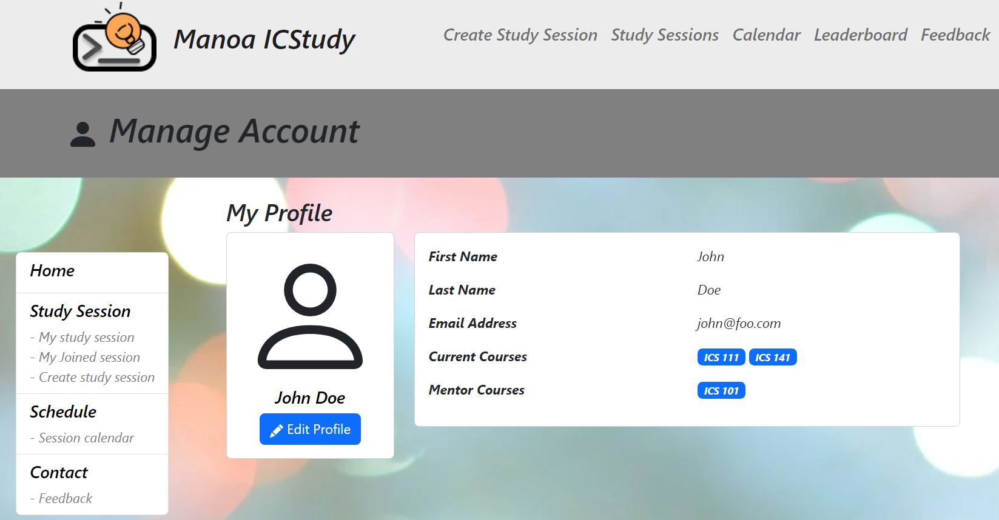
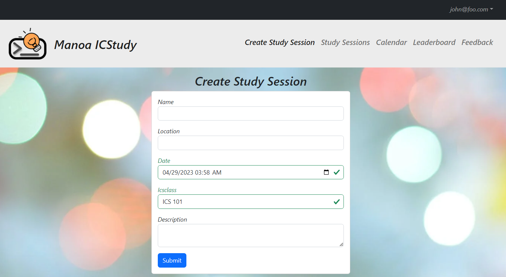
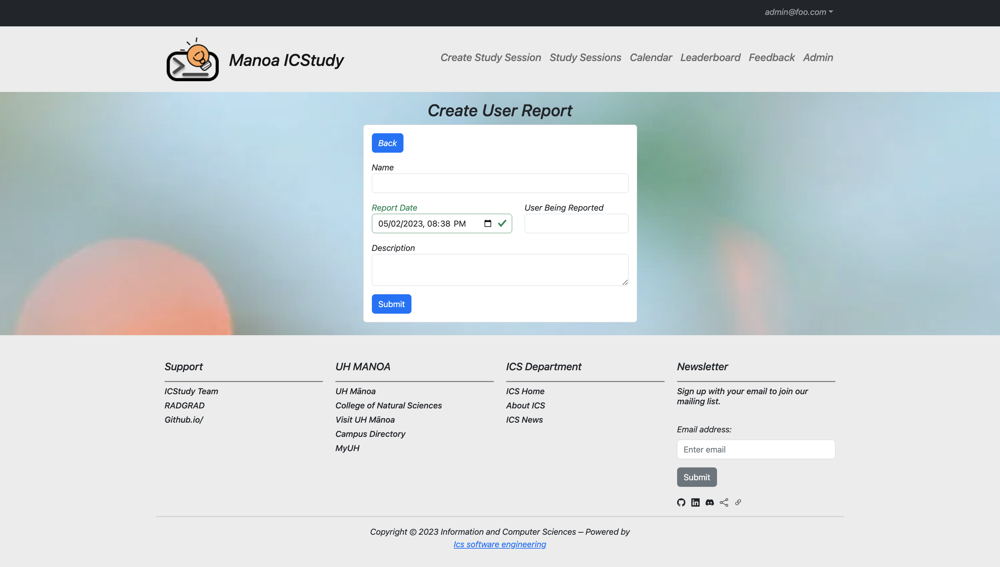
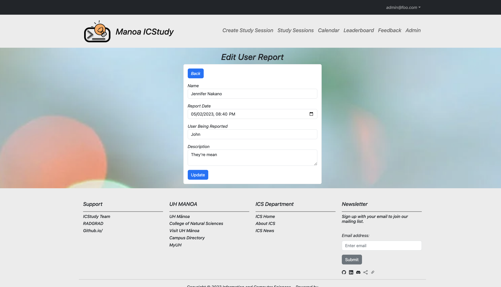
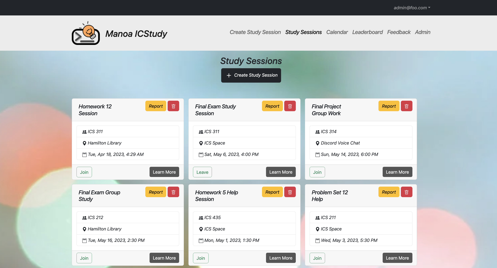
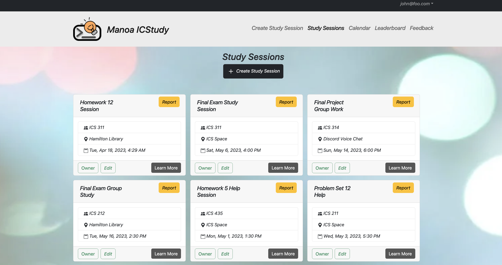
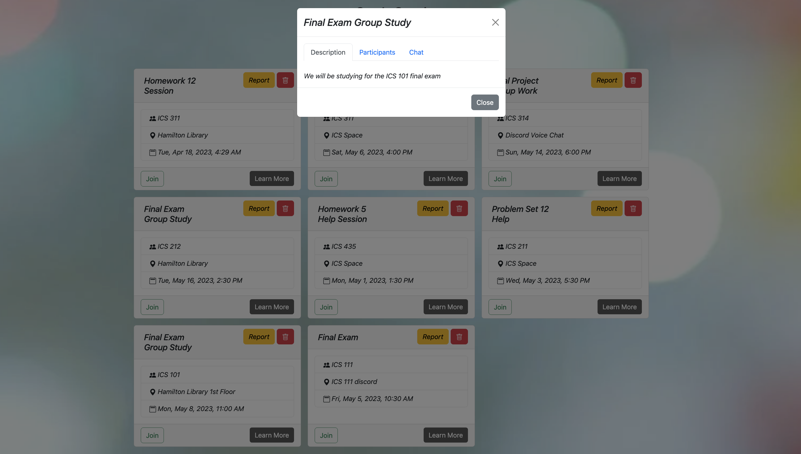
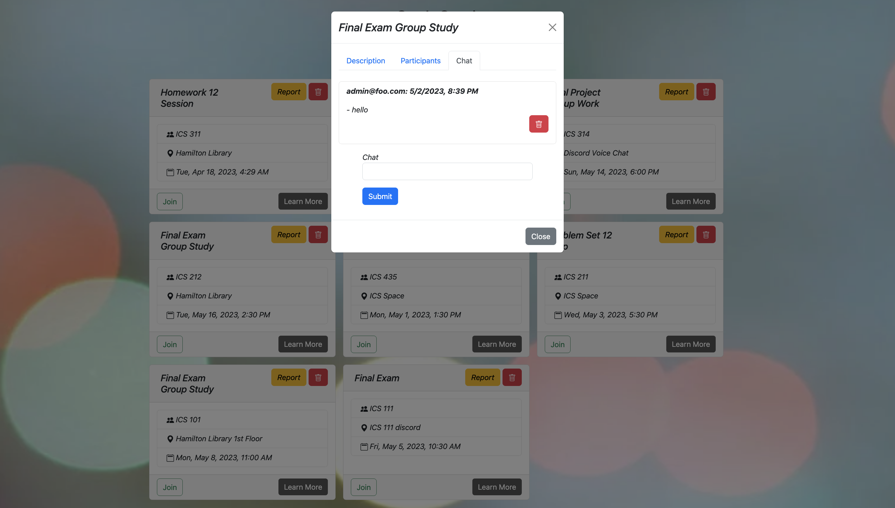
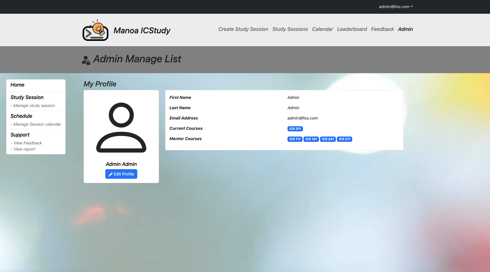
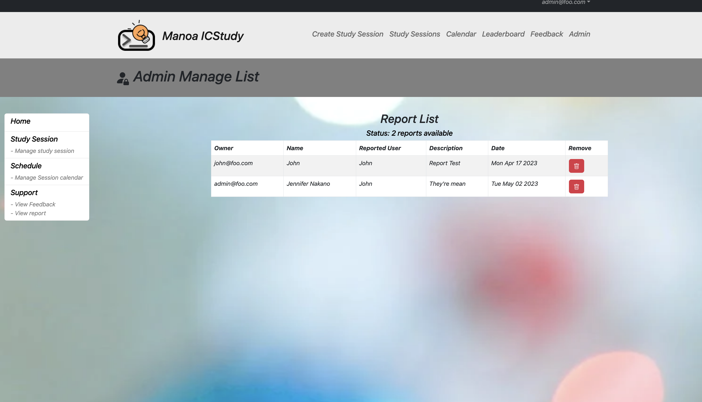

# [Manoa ICStudy](https://manoa-icstudy.site/)

## Table of contents

* [Overview](#overview)
* [Features](#features)
* [User Guide](#user-guide)
* [Community Feedback](#community-feedback)
* [Developer Guide](#developer-guide)
* [Deployment](#deployment)
* [Installation](#installation)
* [Application Design](#application-design)
* [Development History](#development-history)
* [Team](#team)

## Overview

The problem: ICS students often spend more time than they need on their homework and don’t learn the material as effectively as they could, because they study alone and do not leverage the power of face-to-face study groups with peer mentors.

The solution: Manoa ICStudy is an application for UHM ICS students to self-organize face-to-face study groups around a course and/or specific homework or project topic.

## Features
- Create face-to-face study sessions
  - Set location, course, date, time, and description
  - Finds available study sessions to join
  - Automatically sets students in the study session to students and mentors
- Personal User page
- Set courses you have taken and courses you are willing to help others in
- Leaderboard where you gain more points based on joining sessions


## User Guide
Here are the user pages have on our website:

**User Interface**
- Landing page: This is where you will visit first when viewing our site


- Sign In Page: This is where you can sign into your account.


- Register Page: If you don't have an account, you can sign up for one here.


- User Profile Page: This is where you can view and/or edit your information you set up when you first made an account.


- Calendar Page: This is where you can see all of the planned study sessions.


- Create Study Session Page: This is where you can create a study session.


- Study Session Page: This is a list of all study sessions where you can join, report, delete(if you are the owner), and learn more about the study session.


- Create User Report: This is where users can file reports against certain users for misconduct.


- Edit User Report: This is where users can edit reports they've recently filed


- Leaderboard Page: You can gain points by joining study sessions and view it here. If you reach a certain amount of points you can redeem it for a prize in the UH Manoa Bookstore.


- Community Feedback: We are interested in your experience using Manoa ICStudy! If you would like, please take a couple of minutes to fill out this Feedback Form.


**Study Session Features**
- Admin Study Session View: Here we can see that the admin roles have the ability to delete study sessions

- Owner Study Session View: Here we can see a study session view of a user who has created study session. Owners have the ability to edit study sessions.

- Non-Owner Study Session View: Here we can see a regular user view that allows the user to join study session

- Study Session Description: When we click "Learn more" on the study session cards, we can see the description of the study session.

- Study Session Participants: When we click "Learn more" on the study session cards, we can also see a list of participants planning to be a part of the study session and are sorted under mentors and students.

- Study Session Chat: When we click "Learn more" on the study session cards, we can also use a chat that allows people to have discussion/ask questions about the study session or the class.
  


**Special Admin Features**

- Admin Profile: Here we can see that in addition to the user profile, admin roles have their own profiles.

- Admin Report List: Here admin roles can see the reports that have been filed against users.

- Admin Feedback List: Here admin roles can see the feedback users have given about the site


## Community Feedback
We have gotten a lot of feedback about our site and some common points of improvements we've noticed were that we can improve the initial user experience in how the website works and provide more information to the user when requested, such as class descriptions. There are small improvements we can add to existing areas but the overall consensus of the website was very positive.

Here are some of the remarks of those we get feedback from:
- "Overall, I think the website is good, I liked that there was a calendar aspect to it, as well as a leaderboard to make users want to engage and use the website more. The study sessions were also clean, you can see the important notes easily." - Gwyneth
- "Design of the site was intuitive and polished. I especially liked the look of the study session cards and integration of the calendar. I thought the landing page with the animations was nice. I also liked that there were a lot of resources in the footer. Overall, great job! :)" - Kayla
- "The site is easy and simple to navigate. All the information I need to know for the study sessions are available with a single click." - Joshua
- "Good user interface, easy to use scheduling features, and visually appealing display" - Dylan
- "Overall, this website was really fun and has a really nice design." - Urban 

## Developer Guide
This section provides information to developers who wish to use this code base for their own developmental tasks.

## Deployment
We've deployed our application and it can be found [here](https://manoa-icstudy.site/)

### Installation
First, install Meteor.

Second, visit the ICStudy application github page, and click the “Use this template” button to create your own repository initialized with a copy of this application. Alternatively, you can download the sources as a zip file or make a fork of the repo. However you do it, download a copy of the repo to your local computer.

Third, cd into the icstudy/app directory and install libraries with:

```$ meteor npm install```

Fourth, run the system with:

```$ meteor npm run start```

If all goes well, the application will appear at http://localhost:3000.

### Application Design
ICStudy is based upon meteor-application-template-react and meteor-example-form-react. Please use the videos and documentation at those sites to better acquaint yourself with the basic application design and form processing in ICStudy. We also incorporated concepts and resources we learned from our ICS 314 (software engineering) class.

## Development History

### [Milestone 1](https://github.com/orgs/manoa-icstudy/projects/1/views/1?layout=board): 
- Mocking up the overall design of our webpage through competition-based development of our landing page
- Mocking up the content of each of our pages
- Creating necessary documentation and presentations

### [Milestone 2](https://github.com/orgs/manoa-icstudy/projects/3/views/1): 
- Cleaning up the functionality of each page
- Developing necessary collections for storing data
- Making user-interface nicer

### [Milestone 3](https://github.com/orgs/manoa-icstudy/projects/4): 
- Increasing functionality
- Cleaning up user-interface
- Finishing touches

## Team

Manoa ICStudy is designed, implemented, and maintained by [Alexander Hung](https://alexander-hung.github.io/), [Evan Tahara](https://etahara.github.io/), [Jennifer Nakano](https://jennifermnakano.github.io/) and [Jordan Wong](https://jorwo.github.io/)

### [Team Contract](https://docs.google.com/document/d/10MdB72cwWprjIAuWE9Y-79FKaIcFnSHrYCL42ZXevb4/edit?usp=sharing)
