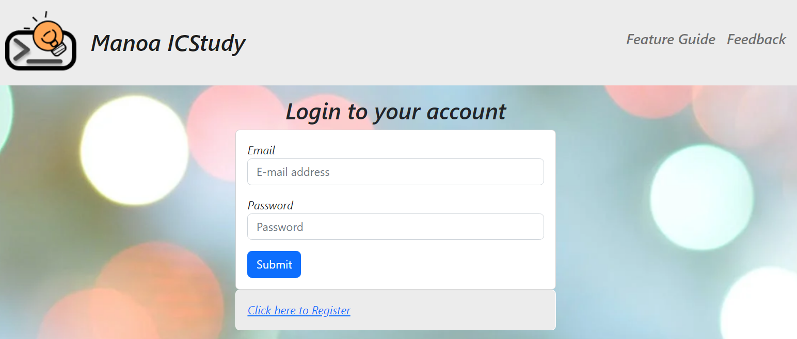
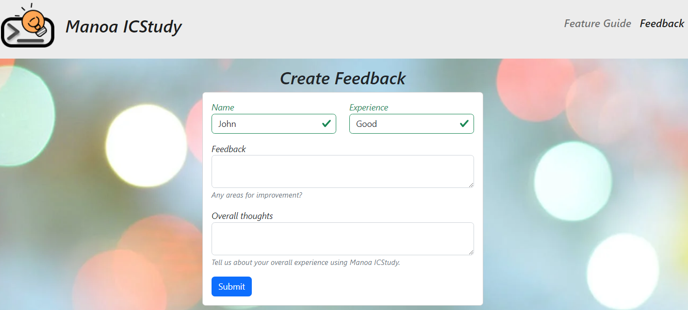

# [Manoa ICStudy](https://manoa-icstudy.site/)

## Table of contents

* [Overview](#overview)
* [Installation](#installation)
* [Community Feedback](#community-feedback)
* [Developer Guide](#developer-guide)
* [Deployment](#deployment)
* [Development History](#development-history)
* [Team](#team)

## Overview

The problem: ICS students often spend more time than they need on their homework and don’t learn the material as effectively as they could, because they study alone and do not leverage the power of face-to-face study groups with peer mentors.

The solution: Manoa ICStudy is an application for UHM ICS students to self-organize face-to-face study groups around a course and/or specific homework or project topic.

## Features
- Create face-to-face study sessions
  - Set location, course, date, time, description, and priorities
  - Finds someone who has previously taken the course and/or someone who is currently taking it
  - Finds available study sessions to join
  - Highlight upcoming sessions today and tomorrow
- Personal User page
- Set courses you have taken and courses you are willing to help others in


## User Guide
Here are the pages we plan to have on our website:

- Landing page


- Sign in page


- Register page


- User profile page


- Calendar page


- Create study session page


- Study session page


- Contact page

  - Community Feedback: We are interested in your experience using Manoa ICStudy! If you would like, please take a couple of minutes to fill out this Feedback Form. It can also be found under our contact page.
  

## Developer Guide
This section provides information to developers who wish to use this code base for their own developmental tasks.

## Deployment
We've deployed our application through Digital Ocean [here](https://manoa-icstudy.site/)

### Installation
First, install Meteor.

Second, visit the ICStudy application github page, and click the “Use this template” button to create your own repository initialized with a copy of this application. Alternatively, you can download the sources as a zip file or make a fork of the repo. However you do it, download a copy of the repo to your local computer.

Third, cd into the icstudy/app directory and install libraries with:

```$ meteor npm install```

Fourth, run the system with:

```$ meteor npm run start```

If all goes well, the application will appear at http://localhost:3000.

### Application Design
ICStudy is based upon meteor-application-template-react and meteor-example-form-react. Please use the videos and documentation at those sites to better acquaint yourself with the basic application design and form processing in ICStudy. We also incorporated concepts and resources we learned from our ICS 314 (software engineering) class.

## Development History

### [Milestone 1](https://github.com/orgs/manoa-icstudy/projects/1/views/1?layout=board): 
- Mocking up the overall design of our webpage through competition-based development of our landing page
- Mocking up the content of each of our pages
- Creating necessary documentation and presentations

### [Milestone 2](https://github.com/orgs/manoa-icstudy/projects/3/views/1): 
- Cleaning up the functionality of each page
- Developing necessary collections for storing data
- Making user-interface nicer

### Milestone 3: 

## Team

Manoa ICStudy is designed, implemented, and maintained by [Alexander Hung](https://alexander-hung.github.io/), [Evan Tahara](https://etahara.github.io/), [Jennifer Nakano](https://jennifermnakano.github.io/) and [Jordan Wong](https://jorwo.github.io/)

### [Team Contract](https://docs.google.com/document/d/10MdB72cwWprjIAuWE9Y-79FKaIcFnSHrYCL42ZXevb4/edit?usp=sharing)

